<p align="center"></p>

# FocusBloom
FocusBloom is a Kotlin Multiplatform Pomodoro app that helps users enhance their productivity and time management skills through focused work intervals and short breaks.

## Platforms
 |  |  | 
---- | ---- | ---- | ----
✅ | ✅ | ✅ | Planned

## Screenshots
### Android
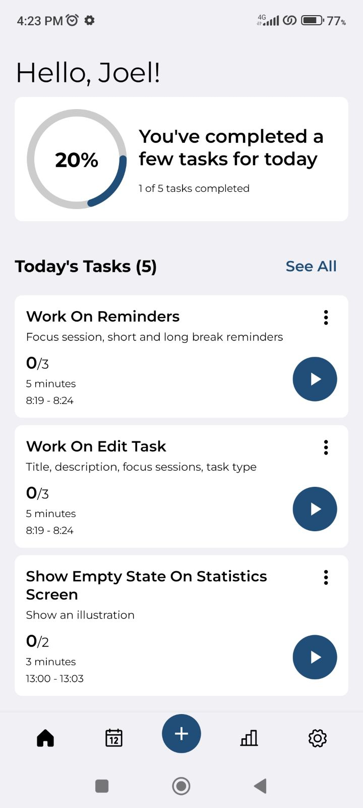 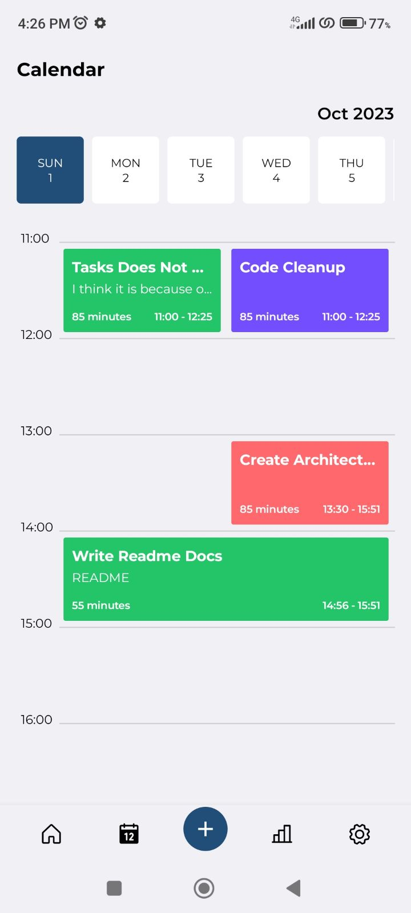 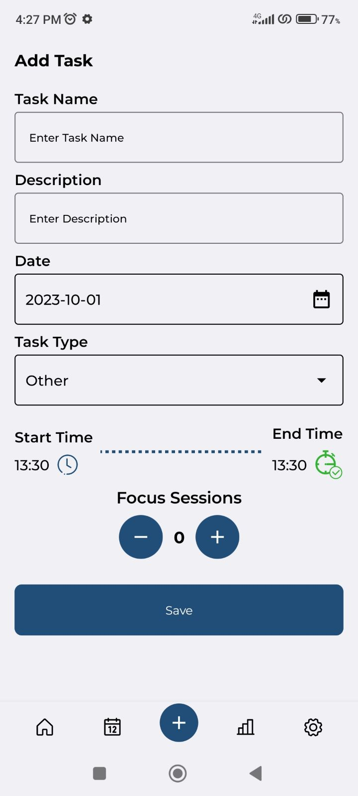  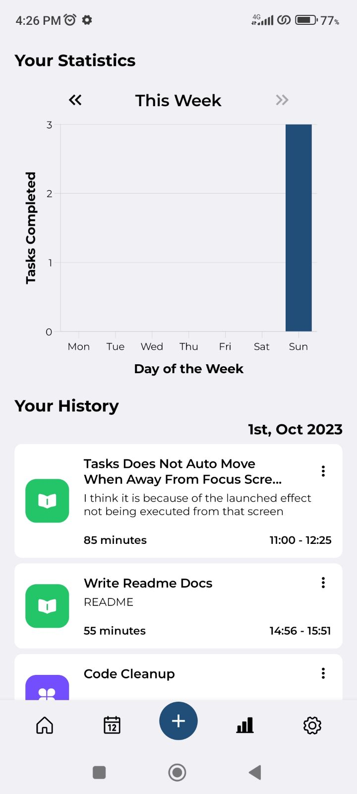 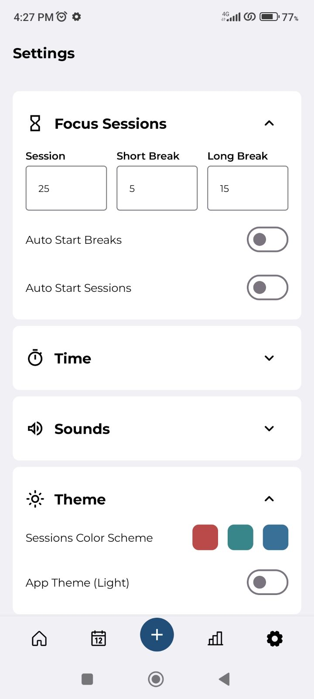 

### iOS
   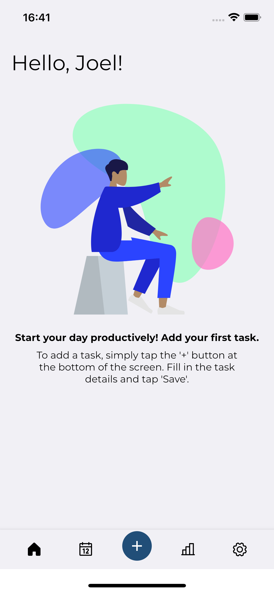 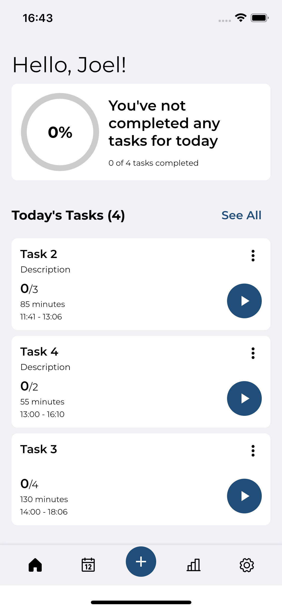 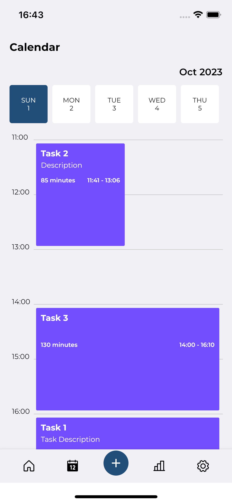 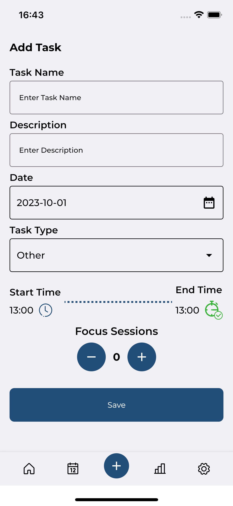 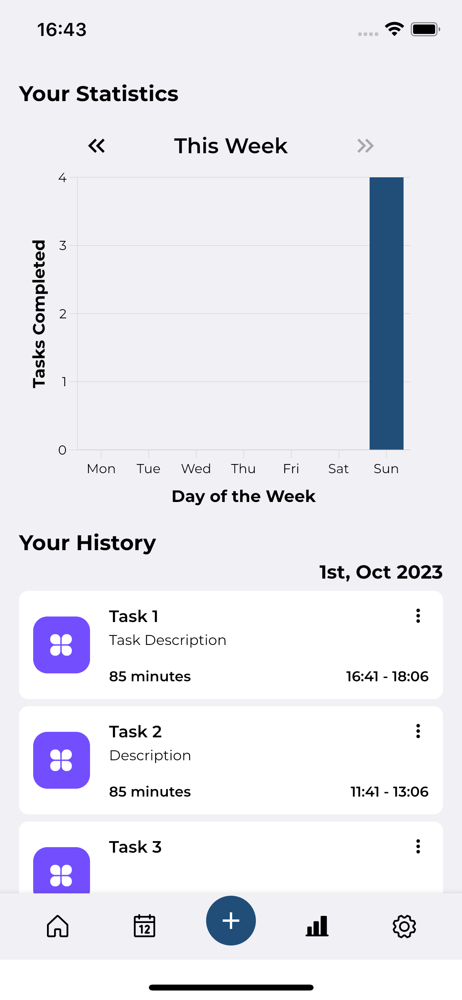 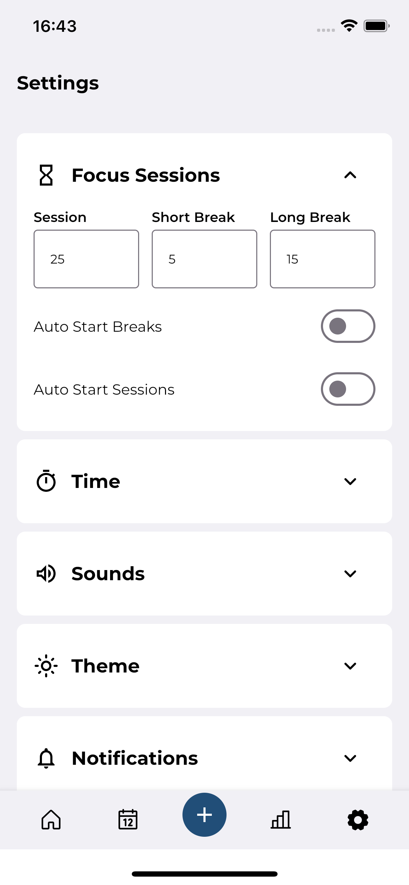

### Desktop


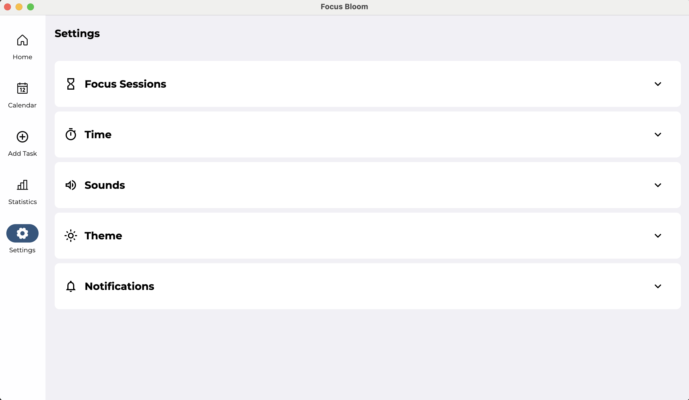
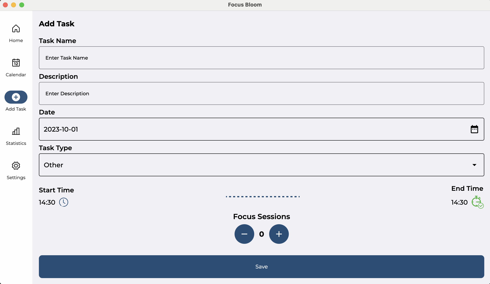
## Architecture
The app is shared between Android, iOS and Desktop. The shared code is written in Kotlin and the UI is built with Compose Multiplatform. The shared code is compiled to Kotlin/JVM for Android and Kotlin/Native for iOS and Desktop.


### Modules
- shared:
  - contains all the shared code between the platforms
  - contains the business logic and data layer
  - contains the UI layer
  - contains the database layer
  - contains the repository layer
- android: contains the android app
  - contains the android app
- ios: contains the ios app
  - contains the ios app 
- desktop: contains the desktop app
  - contains the desktop app 

## Built with
- [Kotlin Multiplatform](https://kotlinlang.org/docs/multiplatform.html) - Kotlin Multiplatform Mobile (KMM) is an SDK that allows you to use the same business logic code in both iOS and Android applications.
- [Compose Multiplatform]()
- [SQLDelight]() - SQLDelight generates typesafe Kotlin APIs from your SQL statements. It allows you to easily query your data and eliminates a lot of boilerplate code you'd normally have to write.

## Run project
### Android
To run the application on android device/emulator:
- open project in Android Studio and run imported android run configuration

To build the application bundle:
- run `./gradlew :composeApp:assembleDebug`
- find `.apk` file in `composeApp/build/outputs/apk/debug/composeApp-debug.apk`

### Desktop
Run the desktop application: `./gradlew :desktop:run`

### iOS
To run the application on iPhone device/simulator:
- Open `ios/iosApp.xcworkspace` in Xcode and run standard configuration
- Or use [Kotlin Multiplatform Mobile plugin](https://plugins.jetbrains.com/plugin/14936-kotlin-multiplatform-mobile) for Android Studio

## Todo
- [ ] Work on Notifications: To remind you of upcoming and overdue tasks
- [ ] Reminders: Sounds for breaks and work sessions
- [ ] 
## Credits
- 
## License
```xml
Copyright 2023 JoelKanyi

    Licensed under the Apache License, Version 2.0 (the "License");
    you may not use this file except in compliance with the License.
    You may obtain a copy of the License at

    http://www.apache.org/licenses/LICENSE-2.0

    Unless required by applicable law or agreed to in writing, software
    distributed under the License is distributed on an "AS IS" BASIS,
    WITHOUT WARRANTIES OR CONDITIONS OF ANY KIND, either express or implied.
    See the License for the specific language governing permissions and
    limitations under the License.
```  
  
